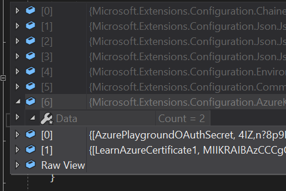

# How to use Azure Key Vault

In short, Azure Key Vault can store keys to do cryptography operations including disk encryption, secrets, and certificates.

This application requires Azure Key Vault. Firstly, you need to create an Azure Key Vault and put the secret to access your Azure AD B2C using OpenID Connect in a key named "AzurePlaygroundOAuthSecret". In an Azure environment, you can configure to allow an VM to have access to Key Vault as a managed service identity (MSI). For development environment, you can use Azure CLI to configure your local machine. Firstly, you need to install [Azure CLI](https://docs.microsoft.com/en-us/cli/azure/install-azure-cli?view=azure-cli-latest).

Then:

- Open Azure SDK command line: Start -> Microsoft Azure -> Command line
- Type: az login. The command will open your default browser for you to login to your Azure subscription. The thing is that if you already logged in on that browser using other subcriptions, you may need to logout of all of them.
- Try: az keyvault secret show --vault-name [yourkeyvaultname] --name [yoursecretname]

To configure Azure Key Vault for your solution, right click on project -> Add -> Connected Service -> Azure Key Vault. VS will do a few things for you, including adding necessary Nuget packages and add two lines to your lauchSettings.json:

```json
        "ASPNETCORE_HOSTINGSTARTUP__KEYVAULT__CONFIGURATIONENABLED": "true",
        "ASPNETCORE_HOSTINGSTARTUP__KEYVAULT__CONFIGURATIONVAULT": "https://NDTLearnAzureKeyVault.vault.azure.net"
```

Given that your machine has access to Azure, the configuration object will load settings from Azure:


